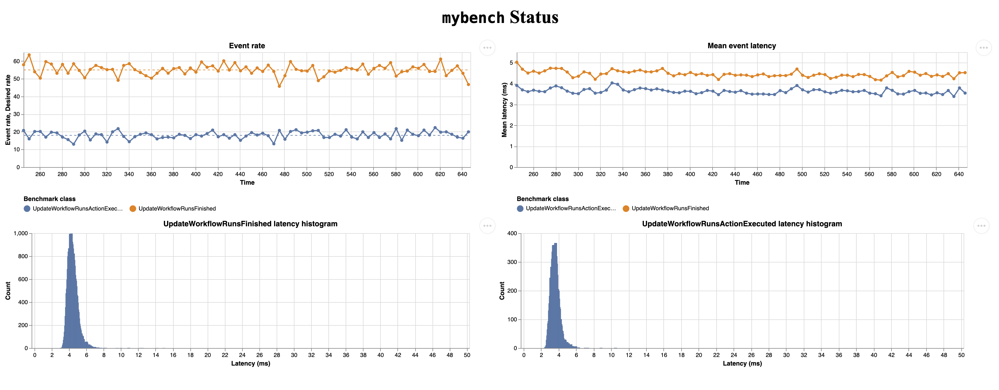
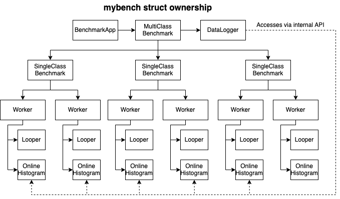

`mybench`
=========

`mybench` is a benchmark authoring library that helps you create your own MySQL benchmark with Golang. This makes it different from tools like [sysbench](https://github.com/akopytov/sysbench) and [benchbase](https://github.com/cmu-db/benchbase), as those other tools take a more command-line-centric approach. Its design is inspired by [OLTPBench](https://www.cs.cmu.edu/~pavlo/papers/oltpbench-vldb.pdf), which is the ancestor to benchbase. The key difference is that `mybench` is specific (for now) to MySQL and aims to make writing benchmark easier by eliminating a lot of the boilerplate. `mybench` also has a nicer monitoring UI, shown as follows:

Capabilities
------------

- A library approach to MySQL benchmarking
- Discretized uniform or Poisson-based rate control: the rate at which the events run is discretized to a relatively low frequency (default: 50hz), as Linux + Golang cannot reliably maintain 100~1000Hz. The number of events run on each iteration is determined by sampling an uniform or Poisson distribution.
- Ability to split a single workload into multiple goroutines, each with its own connection.
- Ability to run multiple workloads simultaneously with data being logged from all workloads.
- Uses [HDR Histogram](https://github.com/HdrHistogram/hdrhistogram-go) to keep track of latency online.
- Web UI for monitoring the current run.
- A simple interface for implementing the data loader (which creates the tables and seed it with data) and the benchmark driver.
- A number of built-in data generators, including thread-safe auto incrementing generators.
- Command line wrapper: A wrapper library to help build command line apps for the benchmark.

Design
------

There are a few important structs defined in this library, and they are:

- `Benchmark`: The main "entrypoint" to running a benchmark. This keeps track of multiple `Workload`s and performs data aggregation across all the `Workload`s and their `BenchmarkWorker`s.
- `WorkloadInterface`: an interface that is defined by the end-user who want to create a benchmark. Notably, the end-user will implement an `Event()` function that should be called at a some specified `EventRate` (concurrently with a number of goroutines).
- `Workload`: Responsible for creating and running the workers (goroutines) to call the `Event()` function of the `WorkloadInterface`.
- `BenchmarkWorker`: Responsible for setting up the `Looper` and keeping track of the worker-local statistics (such as the event latency/histograms for the local goroutine).
- `Looper`: Responsible for discretizing the desired event rate into something that's achievable on Linux. Actually calls the `Event()` function. It can also perform complex discretization such as Poisson-distribution based event sampling.
- `BenchmarkDataLoader`: A data loader helper that helps you easily concurrently load data by specifying only a few options, such as the number of rows and the type of data generator for each columns.
- `BenchmarkApp[T]`: A wrapper to help create a command line app for a benchmark.
- `Table`: An object that helps you create the database and track a default set of data generators.

Internally, the code is roughly laid out with the following ownership:

### Data collection and flow

The benchmark system mainly collects data about the throughput and latency of the `Event()` function call, which contains custom logic (usually MySQL calls). Since `Event()` can be called from a large number of `BenchmarkWorker`s, each `BenchmarkWorker` collects its own statistics for performance reasons. The data collected by the `BenchmarkWorker`s are:

- The count and rate of `Event()`
- The latency distribution of `Event()` as tracked via the [HDR Histogram](https://github.com/HdrHistogram/hdrhistogram-go).
- Unimplemented:
  - How long the worker spent in "saturation" (i.e. `Event()` is slower than the requested event rate). This is probably an important metric for later.
  - The amount of time spent sleeping (could be useful to debug saturation problem in case the looper is incorrectly implemented).
  - Everything in `OuterLoopStat`: wakeup latency, event batch size. This is probably less important than the above.

Having all this data in hundreds of independent Goroutines (`BenchmarkWorkers`) is not particularly useful. The data must be aggregated. This data aggregation is done on the workload level by the `Workload`, which is then aggregated at the `Benchmark` level via the data logger. This description may make it sound like the data collection is initiated by the `BenchmarkWorker`s -- it is not. Instead, every few seconds, the data logger calls the appropriate functions to aggregate data. During data collection, a lock taken for each `BenchmarkWorker`, which allows for the safe reading of data. This is fine as each `BenchmarkWorker` has its own mutex and there's never a lot of contention. If this becomes a problem, lockless programming may be a better approach.

Things that should be done
--------------------------

### Simple feature request and awkward stuff

- The ergonomics of defining a benchmark app could be improved:
  - Defining a struct that implements `WorkloadInterface`  requires 25-30 lines of boilerplate that is very repetitive.
- The monitoring UI could use some more work:
  - The JavaScript needs to report errors, as well as show a few more stats.
  - The JavaScript could be refactored a bit so the code to draw diagram is less repetitive and error prone. I would like to not use any big JS framework and stick to vanilla as much as possible, to make it easier to maintain in the long run.
- Need a bit more log statements in the code without impact the benchmark loop itself, to make it clear what's happening in the code.
  - maybe with `trace.Log`

### Looper optimization

- Back pressure behavior characterization and detection: the looper can theoretically handle back pressure by looping as fast as possible, but how well does this actually work in practise? This is unknown and should be characterized. Further, back pressure should be automatically detected and maybe even visualized.

### Benchmark features

- Storage of worker-local data: each worker has its own connection and own goroutine. The custom workload may need to store goroutine-local (worker-local) variables. This is currently missing.
- Per-worker before/after callbacks: these could be important to allow prepared statement reuse, modifications of worker-local data.
- Evolving workload event rate: the event rate of each workload is currently set to be a constant. This can be changed if there's a need for it.
- Evolving access distribution: This is mentioned in the OLTPBench paper, but I don't know how the library would help with this as it can be purely implemented in the Event function as long as there are space for worker-local data (which is to be implemented).
- Query-level statistics: the library can intercept every query and gather statistics on the query level. How this can be implemented is TBD, but the infrastructure is there (the `Connection` struct wraps the MySQL connection).
- Lock-less operations: right now the code requires a few mutexes to work correctly. Switching it to lock-less programming may make certain operations faster (if they are profiled to be slow...).

### Validation

- Understand what happens to the looper under back-pressure, to make sure the benchmark driver is going as fast as possible.
  - Specifically, if a workload is hitting only 70% of desired, is that uniform across all workers or are 30% of the workers stalled?

Run a benchmark
---------------

- Shopify orders benchmark: `make shopifyorders && build/shopifyorders -host shuhao-mysql-1 -user sys.admin_rw -pass hunter2 -bench -multiplier 700 -note "see if it melts at 70k"`
  - Change the host
  - Change the multiplier. The base rate is only 100 event/s so turn it up!
- Go to https://localhost:8005 to see the monitoring web UI.

Write your own benchmark
------------------------

See [benchmarks](./benchmarks) for examples
