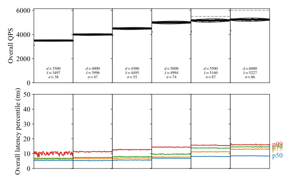

.. _writing-a-benchmark:

================================================
Tutorial: Writing and running a custom benchmark
================================================

Writing a custom benchmark for mybench requires implementing at least two
interfaces, ``mybench.WorkloadInterface`` and ``mybench.BenchmarkInterface``.
As noted in the `architecture doc <detailed-design-doc.html>`_, a ``Benchmark``
contains multiple ``Workload``\s, where each ``Workload`` implements an
``Event()`` function. An example ``Workload`` could be one that issues a
particular sequence of queries for one web request, while a different
``Workload`` could issue a different sequence of queries for a different web
request.

To create a benchmark, it is important to model the workload first. A model of
the system is a simplified version of the production system that still contains
most of the fundamental behaviors of the production system. Creating a suitable
model that matches up with production requires careful examination of the
traffic and query patterns of the system, as well as the system setup itself
(such as CPU, memory, disk, and other "physical" constraints). It also requires
validation of the model with the production workload by comparing and
explaining the similarities and differences of the throughput and latency
results obtained in both benchmark and in production. Model creation and
validation is outside the scope of this document. Instead, this tutorial aims
to teach you how to implement a model in mybench via a simple example.

---------------------
Modeling the workload
---------------------

The simple example we implement is of a simple microblogging service called
Chirp where users can read and write on a single table called ``chirps``.
Before writing the code, we start by documenting the table definition and the
workloads.

Table definition
================

The service is a simplified model and thus does not have the concept of users.
We only have a single table with the following columns:

+----------------+------------------+
| Column name    | Column type      |
+================+==================+
| ``id``         | ``BIGINT(20)``   |
+----------------+------------------+
| ``content``    | ``VARCHAR(140)`` |
+----------------+------------------+
| ``created_at`` | ``DATETIME``     |
+----------------+------------------+

This table also has the following indices:

* ``PRIMARY KEY (id)``
* ``KEY (created_at)``

Workload definition
===================

There are three workloads that query the ``chirps`` table:

One workload consists of reading the 200 of the latest chirps via the following
query, which consists of 75% of the traffic:

.. code-block:: sql

   SELECT * FROM chirps ORDER BY created_at DESC LIMIT 200

A second workload consists of reading a single chirp based on its ``id``, which
consists of 20% of the traffic:

.. code-block:: sql

   SELECT * FROM chirps WHERE id = ?

The third workload consists of the creation of a new chirp with the following
query, which consists of 5% of the traffic:

.. code-block:: sql

   INSERT INTO chirps VALUE (NULL, ?, NOW())

The length of the data in the ``content`` field for each row in the ``chirps``
table will be generated following a predefined histogram distribution. This is
discussed further later, in `Defining the table and data generators`_.

Initial data
============

Since Chirp is a web-scale microblogging platform, we assume that we already
have 10 million chirps in the database.

----------------------------
Creating a project structure
----------------------------

Note: all code for this tutorial can be found `here
<https://github.com/Shopify/mybench/tree/main/benchmarks/tutorialbench>`__.

Mybench is designed to be used as a library. The first step to creating a
benchmark involves importing mybench via `go mod`:

.. code-block:: shell-session

   $ mkdir tutorialbench && cd tutorialbench
   $ go mod init example.com/tutorialbench
   $ go get github.com/Shopify/mybench

For this project, let's create four files:

* ``main.go``: this starts the command line program that corresponds to the
  benchmark.
* ``table_chirps.go``: this contains the definition of the ``chirps`` table and
  the data generator for each column via |mybench.Table|_.
* ``workload_read_latest_chirps.go``: this contains the definition of the
  struct that implements |mybench.WorkloadInterface|_ for the workload that
  reads the latest chirps.
* ``workload_read_single_chirp.go``: same as above but for reading a single
  chirp.
* ``workload_insert_chirp.go``: same as above but for inserting a chirp.
* ``benchmark.go``: this contains the definition of the struct that implements
  |mybench.BenchmarkInterface|_.

It is not necessary to split the benchmark into multiple files. This tutorial
splits these files so they are more easily embedded in this document.

--------------------------------------
Defining the table and data generators
--------------------------------------

Before running the benchmark, we need to first generate the initial data for
the table. To do this, we can create an instance of |mybench.Table|_ in
``table_chirps.go``:

.. literalinclude:: ../benchmarks/tutorialbench/table_chirps.go
   :language: go
   :tab-width: 2

``mybench.Table`` contains the definition for each column via the ``Name`` and
``Definition`` fields on the |mybench.Column|_ type. The ``Generator`` field is
the data generator for that column. The ``mybench.Table`` object is created via
the ``NewTableChirps`` function, which is called during both the ``-load`` and
``-bench`` phases of mybench. During ``-load``, the ``mybench.Table`` object is
used to create the table and load the initial data (see
:ref:`implementing-benchmarkinterface`). In the ``-bench`` phase, the workload
is executed. During these two phases, the data generators may need to generate
different values. Mybench generators can be used to generate values for both
``INSERT`` queries, which require "new" random values, and ``SELECT ... WHERE
column = ?`` queries, which require "existing" values that are present in the
database. The generation of "new" and "existing" values are done via the
``Generator.Generate()`` and ``Generator.SampleFromExisting()`` functions,
respectively.

The generator for the ``id`` column is not defined in this function but is
instead passed in as function arguments. This is because the behaviour of this
data generator should different between the ``-load`` and ``-bench`` phases.
During ``-load``, the data generator needs to generate unique ``id`` values to
be inserted into the database. During ``-bench``, the data generators needs to
sample ``id`` values that likely exist in the database. By passing a different
``id`` generator during each of these phases, the desired behaviours can be
achieved.

For the ``content`` column, we define a histogram generator that generates
random strings according to a `histogram distribution`_ with two parameters:
the first array is the ``binsEndPoints``, which specifies the endpoints of each
bin. Since the lengths generated are supposed to be integers, the endpoints are
+/- 0.5 from the integer values. The second array is the ``frequency``, which
specifies the relative frequency of each bin. In this case, the sum of
``frequency`` is 100. It does not have to be the case as the generator
normalizes the frequency internally. In this example, 25% of the string length
will be between 100 and 119 characters. The distribution of character lengths
between 100 and 119 is uniform. Since none of our workload queries implement a
filter on the ``content`` column, we don't need to be worried about the
behaviour of the generator when generating values for the ``WHERE`` clause.

For the ``created_at`` column, we define a `now generator`_ which generates
``time.Now()`` for insertion. None of our workloads query with this column so
we don't need to be concerned about the behavior for generating values for
``WHERE`` clauses.

Since our modeled table has an index on ``created_at``, we have to specify it
in the ``Indices`` attribute. The primary key of the table is ``id``, so we
specify it into the ``PrimaryKey`` attribute.

.. _histogram distribution: https://pkg.go.dev/github.com/Shopify/mybench#HistogramDistribution
.. _now generator: https://pkg.go.dev/github.com/Shopify/mybench#NewNowGenerator

----------------------------------
Implementing ``WorkloadInterface``
----------------------------------

To implement the read and write workloads, we need to create a struct that
implements |mybench.WorkloadInterface|_. This interface requires three methods
to be implemented:

* ``Event()``: this is the benchmark code to be called with the event rates
  specified in the command line (via the ``-eventrate`` flag). The function
  will be called by multiple workers (and thus goroutines) and must be
  thread-safe.
* ``Config()``: this returns a |mybench.WorkloadConfig|_ which configures
  parameters such as the percentage events allocated to this workload (via
  ``WorkloadScale``), the database config (via ``DatabaseConfig``), the name of
  the workload (via ``Name``), and more.
* ``NewContextData()``: this returns a new context data object of an arbitrary
  type. One context data object is created per benchmark worker and the object
  is passed to the ``Event`` function. The context data is supposed to be a
  variable that stores thread-local data. We will see how this can be used in
  `ReadSingleChirp`_.

``ReadLatestChirps``
====================

The first workload we will define is a simple workload that reads the latest
200 chirps, which consists of 75% of the traffic. This is defined in the
``workload_read_latest_chirps.go`` file:

.. literalinclude:: ../benchmarks/tutorialbench/workload_read_latest_chirps.go
   :language: go
   :tab-width: 2

Note that we only defined the ``Event`` function. This is because ``Config`` is
defined by the embedded ``WorkloadConfig`` and ``NewContextData`` is defined by
the embedded ``NoContextData``. This is designed to make it easier to write
workload code, as most workloads should hold and embed the ``WorkloadConfig``
and most workloads do not need any per-worker data storage (and thus should
embed ``NoContextData``).

The ``Event`` function of this workload takes a single |mybench.WorkerContext|_
argument named ``ctx``. It has a field ``Conn``, which is a
|mybench.Connection|_ object. This is a thin-wrapper around the
`go-mysql-org/go-mysql/client.Conn
<https://pkg.go.dev/github.com/go-mysql-org/go-mysql/client#Conn>`_ for the
time being. The reason this is passed into the ``Event`` function is because
the ``Event`` function can be called concurrently from hundreds of workers,
each running with its own goroutine, and connections are not thread safe. Thus,
each worker has its own ``mybench.Connection`` object and these connections are
passed to the ``Event`` function to ensure thread safety.

Calling ``ctx.Conn.Execute`` executes the query against the database. If an
error occurs, it is returned to mybench. For this workload, since there is only
a single query.

The workload is configured in the ``NewReadLatestChirps`` function that
initializes the struct. The most important lines are the lines that defines the
``Name`` of the workload, which is used for statistics reporting; and the
``WorkloadScale`` of the workload, which is the percentage (as expressed by a
number between 0 and 1) of the events that should be allocated to this workload.
Since this workload is supposed to be 75% of the traffic, we set
``WorkloadScale`` to 0.75. Once the ``WorkloadInterface`` struct is created, we
can create the workload object via ``mybench.NewWorkload``, which is a generic
function parameterized by the type of the context data, which in this case is
``mybench.NoContextData``. The ``NewReadLatestChirps`` function will be called
upon the initialization of the benchmark, which will be described in
:ref:`implementing-benchmarkinterface`.

``ReadSingleChirp``
===================

The second workload we implement is the one where we randomly read a single
chirp. For this exercise, we assume the query is always executed by a prepared
statement. Since a prepared statement is associated with a connection, and each
worker has its own connection object for thread safety, each worker must also
hold its own prepared statement. The only way to do this is via a custom
context data, which is initialized once per worker by mybench. This is all done
with the ``ReadSingleChirp`` workload in the ``workload_read_single_chirp.go``
file:

.. literalinclude:: ../benchmarks/tutorialbench/workload_read_single_chirp.go
   :language: go
   :tab-width: 2

The custom context data for this workload is the struct
``ReadSingleChirpContext``, which has a field holding a statement object
(``*client.Stmt``). Each worker, on start, will call the ``NewContextData``
method to create the prepared statement and store it on a
``ReadSingleChirpContext`` object. The objects are then stored on the workers.
When mybench calls ``Event``, the ``ReadSingleChirpContext`` object is passed
back to ``Event`` via the attribute ``ctx.Data``. The statement object can then
be accessed via ``ctx.Data.stmt``. This is necessary because there is only a
single ``ReadSingleChirp`` object globally and hundreds of benchmark workers
could be all trying to call the ``Event`` function at the same time. To avoid
data races, it is required to store states such as the ``stmt`` on context data
objects like ``ReadSingleChirpContext`` to ensure the ``Event`` function is
`reentrant <https://en.wikipedia.org/wiki/Reentrancy_(computing)>`__.

The other interesting line in this workload is:

.. code-block:: go

   w.table.SampleFromExisting(ctx.Rand, "id")

This `method <https://pkg.go.dev/github.com/Shopify/mybench#Table.SampleFromExisting>`__
attempts to generate a random value that already exists on the database for the
column ``id``. The first argument to this function should always be
``ctx.Rand``, which contains a per-worker instance of ``rand.Rand``. The
per-worker ``rand.Rand`` instances are needed because the global random number
generator functions exported by Go's ``rand`` module uses a global mutex, which
can slow down mybench.

Lastly, the workload is created via the ``mybench.NewWorkload`` generic
function parameterized by the ``ReadSingleChirpContext`` type.

``InsertChirp``
===============

The last workload we will implement is one where we insert new chirps. This is
implemented in the ``workload_insert_chirp.go`` file.

.. literalinclude:: ../benchmarks/tutorialbench/workload_insert_chirp.go
   :language: go
   :tab-width: 2

This is very similar to `ReadLatestChirps`_. The only difference is that we
have these lines in the ``Event()`` function:

.. code-block:: go

   id := w.table.Generate(ctx.Rand, "id")
   content := w.table.Generate(ctx.Rand, "content")
   createdAt := w.table.Generate(ctx.Rand, "created_at")

These lines generate new values for insertion into the database, for the
``id``, ``content`` and ``created_at`` columns. Remember that
``Generate`` generates new values for insertion and ``SampleFromExisting``
generates existing values used in the ``WHERE`` clauses. If you need to
generate a value that's more complex than what the data generators can provide,
you can write custom code to generate the more complicated values in the
``Event`` function as well.

.. _implementing-benchmarkinterface:

-----------------------------------
Implementing ``BenchmarkInterface``
-----------------------------------

We have now implemented the table and the workloads. To run the benchmark, we
must pass these objects to |mybench.Run|_ via |mybench.BenchmarkInterface|_.
``BenchmarkInterface`` requires the definition of four functions:

* ``Name()``: returns the name of the benchmark.
* ``Workloads()``: returns a list of workloads defined for this benchmark.
* ``RunLoader()``: this function is called when the benchmark ran with the
  ``-load`` flag and should load the database with the initial data.
* ``Config()``: returns the benchmark config which configures the entire
  benchmark.

We create a struct that satisfies this interface in the ``benchmark.go`` file:

.. literalinclude:: ../benchmarks/tutorialbench/benchmark.go
   :language: go
   :tab-width: 2

The struct ``ChirpBench`` implements three out of the four methods above
(everything except ``Config()``). This is because the ``Config()`` method is
defined by the embedded ``*mybench.BenchmarkConfig`` objects.
``*mybench.BenchmarkConfig`` should always be embedded as mybench will populate
it with parameters such as the total event rate (via ``-eventrate``),
concurrency (via ``-concurrency``), and so on, via command-line flags. These
parameters are controlled by mybench and should not be customized. Custom
parameters defined by custom command-line flags should be stored on the struct
that implements ``mybench.BenchmarkInterface``, such as the ``ChirpBench``
struct defined here. In this case, the ``InitialNumRows`` is used in
``RunLoader`` so that the ``chirps`` table can be seeded with a configurable
number of rows initially.

``Name()``
==========

The ``Name()`` function is used when the benchmark data is logged. Typically,
this should match the name of the type.

``RunLoader()``
===============

The ``RunLoader()`` method is called when the command line flag ``-load`` is
given. Usually, we can leverage the default data seeding algorithm provided by
``mybench.Table``, via |Table.ReloadData|. This method drops and recreates the
table and concurrently seeds it with data generated via the generators
specified in ``mybench.Table``. In the Chirp example shown here, we create the
``mybench.Table`` object via ``NewTableChirps``. Since we defined this method
to take the ``id`` data generator as an argument, we need to pass it in. During
the initial loading of the data we need to start generating ``id``\s starting
from 1. Thus, we create the |mybench.AutoIncrementGenerator|_ via:

.. code-block:: go

   idGen := mybench.NewAutoIncrementGenerator(0, 0)

The first argument, ``min``, specifies the minimum number that the
``AutoIncrementGenerator`` generates if an "existing" value is to be generated.
This is ignored during the ``-load`` phase as only "new" values are generated in
this phase. The second argument, ``current``, specifies the number that "new"
values should be generated from. Specifically, the new value generated is the
value of ``current`` after it is atomically incremented by 1. Since the default
MySQL behavior is to start ``AUTO_INCREMENT`` columns at the value 1, this
argument is set to 0.

After creating the ``id`` generator and the table, we call the ``ReloadData``.
We pass the value of ``InitialNumRows`` to it, so that a custom number of rows
can be seeded in the table. The batch size is chosen here manually to 200,
which is a good default. The concurrency is set to
``b.BenchmarkConfig.RateControlConfig.Concurrency``, which is controlled by the
``-concurrency`` flag, and this is also a good default. See |Table.ReloadData|_
for more details.

``Workloads()``
===============

This function is called by mybench when it is about to benchmark the workloads.
It returns a list of workloads that you wish mybench to run. Since we already
defined constructor functions for each of our workloads, we call them and
place them in a slice of ``[]mybench.AbstractWorkload``, which is returned.
Once again, we need to define the ``id`` data generator, as it is not defined
by the ``NewTableChirps`` function. In this case, we create the
|mybench.AutoIncrementGenerator|_ via:

.. code-block:: go

   idGen, err := mybench.NewAutoIncrementGeneratorFromDatabase(b.BenchmarkConfig.DatabaseConfig, "chirps", "id")

This method will query the database and determine the minimum and maximum
``id`` values and set the ``min`` and ``current`` with those values
respectively. With these set, ``SampleFromExisting`` will return a random value
between ``min`` and ``current``, which corresponds to an ``id`` value that
should exist on the database.  ``Generate`` will generate the value
``current+1`` (and also update ``current = current + 1``), which always
corresponds to an ``id`` value that does not exist in the database. This
generator ensures both the `ReadSingleChirp`_ and `InsertChirp`_ workloads
generate suitable ``id`` values for both ``SELECT ... WHERE id = ?`` and
``INSERT INTO ... (id, ...) VALUE (?, ...)``.

.. _putting-it-together-in-main:

-------------------------------------
Putting it all together in ``main()``
-------------------------------------

Lastly, we need to call |mybench.Run|_ in a ``main()`` function. To do this, we
define the ``main.go`` file:

.. literalinclude:: ../benchmarks/tutorialbench/main.go
   :language: go
   :tab-width: 2

In the ``main()`` function, we first create the ``ChirpBench`` object. The
``BenchmarkConfig`` is initialized with ``mybench.NewBenchmarkConfig``, which
will set up flags such as ``-load``, ``-bench``, ``-eventrate``,
``-concurrency``, and more. The values specified in the command line flags are
stored on the ``BenchmarkConfig`` object. Additionally, since we defined the
``InitialNumRows`` custom parameter, we set it up as a command line flag. This
is done via Go's standard ``flag`` library. We then call ``flag.Parse()`` to
ensure the command line flags are parsed and all configuration values are
filled.

Once the benchmark interface is properly initialized, we call
``mybench.Run``, which will run the data loader if ``-load`` is specified on
the command line, or the benchmark if ``-bench`` is specified on the command
line.

---------------------
Running the benchmark
---------------------

First we must build the benchmark that we developed:

.. code-block:: shell-session

   $ go build -o tutorialbench .

We can then run the loader to initialize the database. You'll need to replace
the value for ``-host``, ``-user``, and ``-pass`` to your database's
configuration.

.. code-block:: shell-session

   $ ./tutorialbench -host mysql-57.local -user sys.admin_rw -pass hunter2 -load
   INFO[0000] reloading data                                batchSize=200 concurrency=16 table=chirps totalrows=10000000
   INFO[0000] loading data                                  pct=0 rowsInserted=200 table=chirps totalrows=10000000
   INFO[0000] loading data                                  pct=1 rowsInserted=100400 table=chirps totalrows=10000000
   ...
   INFO[0056] loading data                                  pct=99.19 rowsInserted=9919400 table=chirps totalrows=10000000
   INFO[0057] data reloaded                                 pct=100 rowsInserted=10000000 table=chirps totalrows=10000000

To run the actual benchmark:

.. code-block:: shell-session

   $ ./tutorialbench -host mysql-57.local -user sys.admin_rw -pass hunter2 -bench
   INFO[0000] running benchmark indefinitely
   INFO[0000] starting benchmark workers                    concurrency=1 rate=50 workload=InsertChirp
   INFO[0000] starting benchmark workers                    concurrency=2 rate=200 workload=ReadSingleChirp
   INFO[0000] starting benchmark workers                    concurrency=8 rate=750 workload=ReadLatestChirps
   ...

To monitor the benchmark live (throughput and latency for each workload), go to https://localhost:8005.

To discover how much your load database can handle, we create a shell script
that runs the benchmark for 2 minutes each with incrementing event rate. The
goal is to observe when the database can no longer handle the desired event
rate. We can save this script to ``benchmark.sh``.

.. code-block:: bash

   #!/bin/bash
   ./tutorialbench -host mysql-57.local -user sys.admin_rw -pass hunter2 -load
   ./tutorialbench -host mysql-57.local -user sys.admin_rw -pass hunter2 -bench -duration 2m -eventrate 3500
   ./tutorialbench -host mysql-57.local -user sys.admin_rw -pass hunter2 -bench -duration 2m -eventrate 4000
   ./tutorialbench -host mysql-57.local -user sys.admin_rw -pass hunter2 -bench -duration 2m -eventrate 4500
   ./tutorialbench -host mysql-57.local -user sys.admin_rw -pass hunter2 -bench -duration 2m -eventrate 5000
   ./tutorialbench -host mysql-57.local -user sys.admin_rw -pass hunter2 -bench -duration 2m -eventrate 5500
   ./tutorialbench -host mysql-57.local -user sys.admin_rw -pass hunter2 -bench -duration 2m -eventrate 6000

In this script, we first reload the data so the database can have a fresh
start, then we run ``tutorialbench`` 5 times starting at an event rate of
3500 and end at an event rate of 6000. Each benchmark has a duration of 2
minutes.

To run this script:

.. code-block:: shell-session

   $ rm -f data.sqlite
   $ ./benchmark.sh

Since mybench will append data from runs into an existing ``data.sqlite`` file
(even if you use different benchmarks), we remove the ``data.sqlite`` file
before we start the benchmarks to ensure the data logged in the file pertains
to only this sequence of run.

------------------------
Post processing the data
------------------------

To post-process the data, copy the ``data.sqlite`` file into the
``analysis-tools`` folder of the mybench repository. Then, you can run the
`Jupyter Notebook`_ called ``sample.ipynb``. The dependency of the Jupyter
Notebook is documented in the ``environment.yml`` file, which is a file you can
use to `install a conda environment`_. If you run the code in the first
cell, it will generate a figure that looks like the following:

The top plots show the overall QPS and the bottom plots show the overall
latency percentil for the 6 benchmark runs. In the top plots, the variable
:math:`d` represents the desired rate for that run. :math:`\bar{x}` is the
average rate achieved by mybench within the duration of the benchmark run.
:math:`\sigma` is the standard deviation of the rate. In the bottom plot, each
color represents a different percentile. The percentiles that correspond to
each line are annotated to the right of the plots.

In this case, we can see that the database can only handle a QPS of about 5000
for the ``chirps`` workload as the observed event rate plateaus once the
desired event rate reaches that point. Additionally, the latency distribution
shifts higher around 5000 events/s.

.. _Jupyter Notebook: https://jupyter.org/
.. _install a conda environment: https://conda.io/projects/conda/en/latest/user-guide/tasks/manage-environments.html#creating-an-environment-from-an-environment-yml-file

------
Review
------

In this tutorial, we have learned to:

* create a basic model for a workload;
* create a project structure for a custom mybench benchmark;
* define the table columns with |mybench.Table|_ with both their SQL definition
  and their associated generators;
* implement |mybench.WorkloadInterface|_ with workloads that both require and
  does not require custom context data;
* use the data generator to generate values for insertion (``Generate()``) and
  values used for WHERE clauses (``SampleFromExisting()``);
* implement |mybench.BenchmarkInterface|_;
* put everything together in a ``main()`` function so it can be called from
  command line;
* write code that takes allow the benchmark to take custom configurations;
* run the benchmark with varying event rates and duration;
* perform a sequence of benchmark runs to ascertain the limits of the database;
* post process the data with Python to visualize a sequence of benchmark runs.

The code for ``tutorialbench`` can be found `here
<https://github.com/Shopify/mybench/tree/main/benchmarks/tutorialbench>`__.

.. |mybench.Table| replace:: ``mybench.Table``
.. _mybench.Table: https://pkg.go.dev/github.com/Shopify/mybench#Table

.. |mybench.BenchmarkInterface| replace:: ``mybench.BenchmarkInterface``
.. _mybench.BenchmarkInterface: https://pkg.go.dev/github.com/Shopify/mybench#BenchmarkInterface

.. |mybench.Column| replace:: ``mybench.Column``
.. _mybench.Column: https://pkg.go.dev/github.com/Shopify/mybench#Column

.. |mybench.DataGenerator| replace:: ``mybench.DataGenerator``
.. _mybench.DataGenerator: https://pkg.go.dev/github.com/Shopify/mybench#DataGenerator

.. |mybench.HistogramLengthStringGenerator| replace:: ``mybench.HistogramLengthStringGenerator``
.. _mybench.HistogramLengthStringGenerator: https://pkg.go.dev/github.com/Shopify/mybench#HistogramLengthStringGenerator

.. |mybench.AutoIncrementGenerator| replace:: ``mybench.AutoIncrementGenerator``
.. _mybench.AutoIncrementGenerator: https://pkg.go.dev/github.com/Shopify/mybench#AutoIncrementGenerator

.. |mybench.WorkloadInterface| replace:: ``mybench.WorkloadInterface``
.. _mybench.WorkloadInterface: https://pkg.go.dev/github.com/Shopify/mybench#WorkloadInterface

.. |mybench.WorkloadConfig| replace:: ``mybench.WorkloadConfig``
.. _mybench.WorkloadConfig: https://pkg.go.dev/github.com/Shopify/mybench#WorkloadConfig

.. |mybench.Connection| replace:: ``mybench.Connection``
.. _mybench.Connection: https://pkg.go.dev/github.com/Shopify/mybench#Connection

.. |mybench.Run| replace:: ``mybench.Run``
.. _mybench.Run: https://pkg.go.dev/github.com/Shopify/mybench#Run

.. |mybench.WorkerContext| replace:: ``mybench.WorkerContext``
.. _mybench.WorkerContext: https://pkg.go.dev/github.com/Shopify/mybench#WorkerContext

.. |Table.ReloadData| replace:: ``Table.ReloadData``
.. _Table.ReloadData: https://pkg.go.dev/github.com/Shopify/mybench#Table.ReloadData
